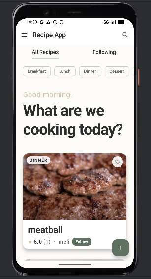
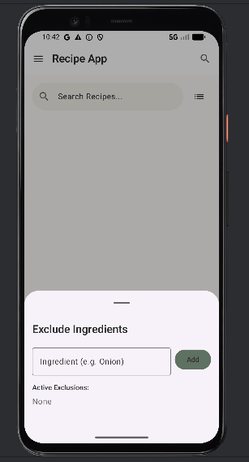
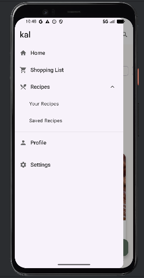
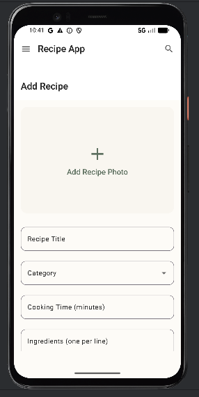
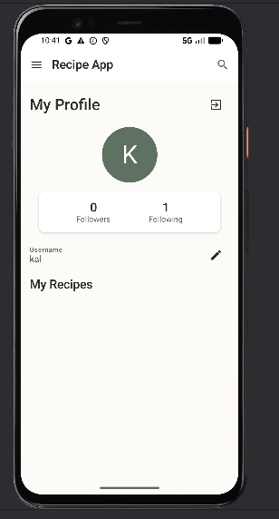
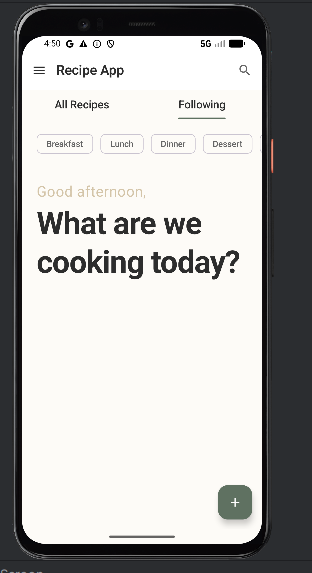
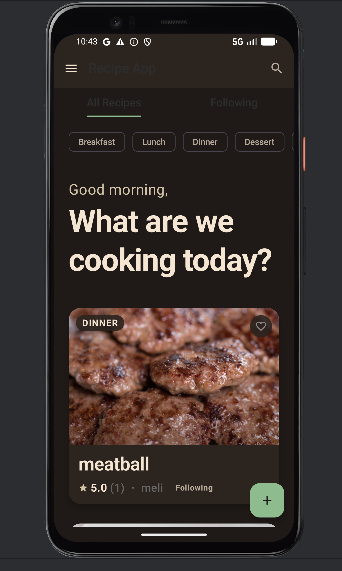

# 🍽️ Recipe App

A full-featured Android recipe application built as a portfolio project. Users can discover, create, rate, and save recipes — and follow other home cooks in their community.


---

## ✨ Features

### 🔐 Authentication

| Feature | Description |
|---|---|
| 📧 Email/Password Login | Secure sign-up and sign-in via Supabase Auth |
| 🔵 Google Sign-In | One-tap authentication with Google |
| 👤 Guest Mode | Browse content without creating an account |
| 🎂 Age Verification | Birth date check during registration |

### 📱 Recipe Experience

| Feature | Description |
|---|---|
| 🏠 Discover Feed | Scrollable card feed with All Recipes & Following tabs |
| 🗂️ Category Filter | Filter by Breakfast, Lunch, Dinner, Dessert, or Snack |
| 📖 Recipe Detail | Full view with image, ingredients, and step-by-step instructions |
| ⭐ Star Ratings | Rate recipes 1–5 stars (one rating per user) |
| 💬 Reviews | Comment on recipes with likes and timestamps |
| 🍳 Cooking Mode | Fullscreen, distraction-free reading mode |
| 👥 Follow System | Follow/unfollow creators and filter feed by following |
| ❤️ Optimistic Favorites | Instant UI updates for favorite toggling |

### ➕ Create & Manage

| Feature | Description |
|---|---|
| 📝 Create Recipes | Add title, ingredients, instructions, category, and cooking time |
| 🖼️ Photo Upload | Attach a recipe photo from the gallery |
| ✏️ Edit & Delete | Full control over your own recipes |
| 🔍 Search | Fuzzy full-text search across titles and ingredients |

### ⚙️ Other

| Feature | Description |
|---|---|
| 🛒 Shopping List | Accumulate ingredients from multiple recipes |
| 🌙 Dark Mode | Full dark theme support |
| 📶 Offline Favorites | Room-cached favorites available offline |

---

## 📸 Screenshots

<div align="center">

| Sign In | Home | Search |
|:---:|:---:|:---:|
|  |  |  |

| Recipe Detail | Add Recipe | Profile |
|:---:|:---:|:---:|
|  |  |  |

| Following Feed | Dark Mode |
|:---:|:---:|
|  |  |

</div>

---

## 🏗️ Architecture

This project follows **Clean Architecture** with **MVVM** pattern:

```
app/
├── data/
│   ├── local/          # Room Database (Favorites cache)
│   ├── remote/         # Supabase API clients & DTOs
│   └── repository/     # Repository implementations
├── domain/
│   ├── model/          # Domain models
│   ├── repository/     # Repository interfaces
│   └── usecase/        # Use cases (single-responsibility)
├── presentation/
│   ├── auth/           # Login, Registration screens
│   ├── home/           # Discover feed + ViewModel
│   ├── detail/         # Recipe detail screen + ViewModel
│   ├── add_edit/       # Create/Edit recipe screen
│   ├── search/         # Search screen
│   ├── profile/        # User profile screen
│   ├── favorites/      # Saved recipes screen
│   ├── cooking/        # Cooking mode (fullscreen)
│   ├── shopping/       # Shopping list screen
│   ├── settings/       # App settings
│   ├── components/     # Shared composables (RecipeCard, etc.)
│   └── navigation/     # NavGraph + Screen sealed class
└── di/                 # Dependency Injection (Hilt)
```

### Key Patterns

| Pattern | Usage |
|---|---|
| **MVVM** | ViewModels expose `StateFlow<UiState>`, screens observe state |
| **Repository Pattern** | All data access goes through domain interfaces |
| **Use Cases** | Single-responsibility use cases wrap repository calls |
| **Sealed Classes** | `DetailEvent`, `UiEvent`, `Screen` for type-safe navigation |
| **Optimistic Updates** | Favorites toggle updates UI instantly, reverts on failure |

---

## 🛠️ Tech Stack

| Category | Technology |
|---|---|
| **Language** | Kotlin |
| **UI** | Jetpack Compose + Material 3 |
| **Architecture** | Clean Architecture + MVVM |
| **Dependency Injection** | Hilt (Dagger) |
| **Navigation** | Compose Navigation (type-safe `Screen` sealed class) |
| **Backend** | Supabase (Auth, PostgreSQL, Storage) |
| **Local Storage** | Room (Favorites cache) |
| **Async** | Kotlin Coroutines + StateFlow |
| **Image Loading** | Coil |
| **Serialization** | kotlinx.serialization |

---

## 🚀 Getting Started

### Prerequisites
- Android Studio Hedgehog or later
- JDK 17+
- Android SDK 34
- A Supabase project ([supabase.com](https://supabase.com))

### Setup

> ⚠️ **Important:** This project uses Supabase for backend services. For security reasons, credentials are not included in the repository.

1. **Clone the repository**
   ```bash
   git clone https://github.com/NurOzn/recipe-app.git
   cd recipe-app
   ```

2. **Configure Supabase**

   Create `app/src/main/res/values/secrets.xml`:
   ```xml
   <resources>
       <string name="supabase_url">YOUR_SUPABASE_URL</string>
       <string name="supabase_anon_key">YOUR_SUPABASE_ANON_KEY</string>
   </resources>
   ```

3. **Create the database tables**

   Run the SQL migration scripts in the `/supabase` directory to create the required tables and RLS policies.

4. **Build and Run**

   Open the project in Android Studio and run on an emulator or physical device (API 26+).

---

## 🗄️ Database Schema (Supabase)

| Table | Purpose |
|---|---|
| `profiles` | Public user profiles (id, username, avatar_url) |
| `recipes` | Recipe data (title, ingredients, instructions, category, time) |
| `ratings` | Per-user recipe ratings (upserted on conflict) |
| `favorites` | User → Recipe join table |
| `follows` | User → User follow relationships |
| `comments` | Recipe reviews with content and timestamp |
| `comment_likes` | Per-user comment likes |
| `shopping_list` | Ingredients saved by the user |

---

## 📄 License

MIT License

Copyright (c) 2025 Melike Nur Özün

Permission is hereby granted, free of charge, to any person obtaining a copy of this software and associated documentation files (the "Software"), to deal in the Software without restriction, including without limitation the rights to use, copy, modify, merge, publish, distribute, sublicense, and/or sell copies of the Software.

---

## 🤝 Contributing

Pull requests are welcome! For major changes, please open an issue first to discuss what you would like to change.

---

## 📧 Contact

Developed by **Melike Nur Özün**
📩 [melikenurozn@gmail.com](mailto:melikenurozn@gmail.com)
